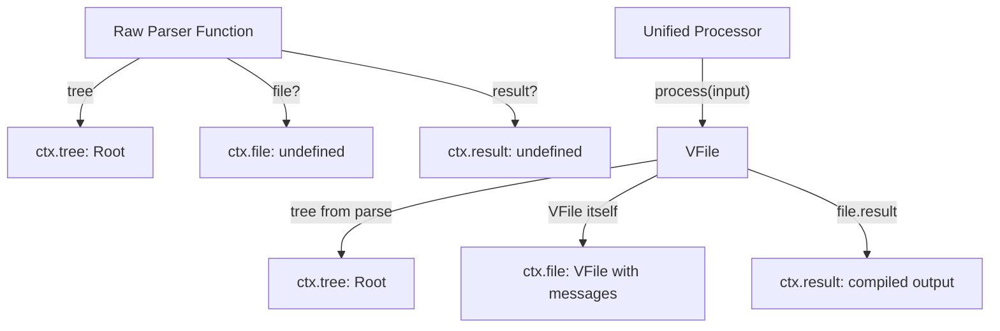

# refactor: Extract MLLP parser into Fastify-style lifecycle stage

## Overview

Replace the MLLP server's constructor-option parser (`new Mllp({ parser })`) with a dedicated lifecycle stage registered via `app.parser()`. The parser becomes a required, architecturally distinct registration — separate from `.use()` middleware — following Fastify's pattern of separating content-type parsers from hooks/middleware. `app.parser()` accepts both raw parser functions and unified processors directly, handling the wiring internally. The context is expanded to surface all unified pipeline outputs: tree, file (diagnostics), and compiled result.

## Problem Frame

The MLLP server currently accepts a `parser` as a constructor option with a built-in default. This hides parsing as a silent implementation detail rather than a visible lifecycle stage:

1. **Parser is hidden** — It's a constructor option with a silent default, not a visible lifecycle stage
2. **No post-construction customization** — The parser can't be changed after the Mllp instance is created
3. **ADR-0011 gap** — The ADR anticipated `tree: Root | undefined` and processor registration via `.use()`, but the implementation made parser a constructor option
4. **Unified pipeline outputs are lost** — When a unified processor with a compiler (e.g., `hl7v2Jsonify`) is used, `process()` produces a compiled result (`file.result`) and diagnostics (`file.messages`), but the current context only surfaces `tree` and `file`. The compiled result (e.g., JSON) is inaccessible.

## Requirements Trace

- R1. Parser registration uses a dedicated API (`app.parser()`), architecturally separate from `.use()` middleware
- R2. No default parser — users must explicitly register a parser; calling `handle()` without one throws a clear error (configuration error, not routed to `onError`)
- R3. `app.parser()` accepts both raw parser functions and unified processors (duck-typed via `.process()` method), handling the wiring internally
- R4. The parser lifecycle stage runs at a fixed point in the `handle()` flow (same position as today — during context creation)
- R5. Existing middleware source code (e.g., ACK middleware) continues to work without changes — `ctx.tree` is still `Root` by the time middleware runs. Test files across packages will need `app.parser()` calls added.
- R6. `MllpOptions.parser` constructor option is removed (clean break, no deprecated alias)
- R7. Context is expanded to surface all unified pipeline outputs: `ctx.tree` (AST), `ctx.file` (VFile with diagnostics), and `ctx.result` (compiled output from the processor's compiler, e.g., JSON)

## Scope Boundaries

- **In scope:** Parser API change, unified processor acceptance with full pipeline wiring, expanded context with `result` field, error on missing parser, test updates across all packages, JSDoc/example updates
- **Not in scope:** Lightweight MSH extraction, transport layer changes, ACK middleware source code changes
- **Not in scope:** Making `ctx.tree` optional — the parser is required, so tree is always populated before user code runs

## Context & Research

### Relevant Code and Patterns

- `packages/hl7v2-mllp/src/server/mllp.ts` — Main Mllp class. Constructor takes `MllpOptions { parser? }`. `handle()` passes parser to `createContext()`.
- `packages/hl7v2-mllp/src/server/context.ts` — `createContext()` calls parser (or default `parseHL7v2`), extracts routing fields from AST via `queryValue()`.
- `packages/hl7v2-mllp/src/server/types.ts` — `MllpOptions`, `Parser`, `ParseResult`, `Context` type definitions.
- `packages/hl7v2-mllp/src/index.ts` — Public exports including `MllpOptions`.
- `packages/hl7v2-mllp/src/node/serve.ts` — JSDoc example shows `new Mllp()` without parser.
- `packages/hl7v2-mllp-ack/src/ack.ts` — ACK middleware accesses `ctx.tree`.
- `packages/hl7v2/src/index.ts` — Pre-configured unified pipeline: parser → annotate → decode escapes → lint → jsonify.
- `packages/hl7v2-jsonify/src/` — Compiler plugin that produces `Hl7v2JsonResult` (array of `SegmentJson | GroupJson`).
- `packages/hl7v2-mllp/test/server/mllp.test.ts` — Tests including custom parser via `new Mllp({ parser })`.
- `packages/hl7v2-mllp/test/node/serve.test.ts` — 8 instances of `new Mllp()` using default parser.
- `packages/hl7v2-mllp-ack/test/ack.test.ts` — 19 instances of `new Mllp()` using default parser.

### Unified Pipeline Deep Dive

The unified framework has three distinct phases that produce different outputs:

| Method           | Phase                       | Returns                                 | In HL7v2 pipeline                                  |
| ---------------- | --------------------------- | --------------------------------------- | -------------------------------------------------- |
| `parse(input)`   | Parse only                  | Root tree                               | Raw AST with delimiters                            |
| `run(tree)`      | Transform only              | Transformed tree                        | Annotations, escape decoding, linting diagnostics  |
| `process(input)` | Parse + Transform + Compile | VFile with `.result`, `.messages`, tree | Full pipeline: AST → transforms → JSON compilation |

**After `process(input)`**, the VFile contains:

- `file.value` — the original input
- `file.result` — compiled output from the compiler (e.g., `Hl7v2JsonResult` from jsonify)
- `file.messages` — diagnostics/lint messages from transformer plugins
- The tree is accessible through the unified internals

**The HL7v2 pipeline** (`packages/hl7v2/src/index.ts`):

```
unified()
  .use(hl7v2Parser)                        // Parse: text → Root AST
  .use(hl7v2MessageStructure)              // Transform: resolve MSH-9.3
  .use(hl7v2DecodeEscapes)                 // Transform: decode escape sequences
  .use(hl7v2PresetLintRecommended)         // Transform: lint rules → file.messages
  .use(hl7v2PresetLintProfileRecommended)  // Transform: profile lint rules
  .use(hl7v2Jsonify)                       // Compile: tree → Hl7v2JsonResult
```

### Framework Research

| Framework   | Parser approach                                                                     | Key lesson                                                                                              |
| ----------- | ----------------------------------------------------------------------------------- | ------------------------------------------------------------------------------------------------------- |
| **Fastify** | Separate lifecycle stage (`addContentTypeParser` vs `addHook`), runs at fixed point | Best-in-class architectural separation — parser is not middleware, has its own API                      |
| **Express** | Was extracted to external middleware, re-bundled after confusion                    | Cautionary tale, but our case differs: we're not making parser optional, just giving it a dedicated API |
| **tRPC**    | Part of procedure definition, type-system enforced                                  | Enforced parser registration is the right pattern for required infrastructure                           |

### Institutional Learnings

- **ADR-0011** anticipated processor registration via `.use()` with duck-typing (`if argument has .process() and .use() methods, treat as unified processor`) and `tree: Root | undefined`
- **ADR-0006** established that parser has minimal options and settings come from the unified layer

## Key Technical Decisions

- **Fastify-style lifecycle separation:** The parser gets its own API (`app.parser()`) and runs at a fixed lifecycle point. This is architecturally enforced, not convention-based.

- **`app.parser()` handles full wiring for unified processors:** When passed a unified processor, `app.parser()` calls `processor.process(input)` internally and maps the VFile outputs to context fields. Users never need to write wrapping boilerplate. Duck-typed via `.process()` method presence.

- **Context expanded with `result` field:** The context surfaces all unified pipeline outputs progressively:
  - `ctx.tree` — always present (Root AST, parsed + transformed)
  - `ctx.file` — present when using unified pipeline (VFile with diagnostics/messages)
  - `ctx.result` — present when the pipeline includes a compiler (e.g., compiled JSON from jsonify)
    This is a progressive enhancement: raw parser users get just `tree`, unified pipeline users get the full picture.

- **No default parser — explicit registration required:** Users must call `app.parser()`. If `handle()` is called without a parser, it throws `MllpError` before the try/catch block — this is a configuration error that intentionally does not route to `onError`.

- **`app.parser()` is last-write-wins:** Calling it multiple times replaces the previous parser. No error on double-registration.

- **Clean break — remove `MllpOptions.parser`:** No deprecated alias per project preference.

## Open Questions

### Resolved During Planning

- **Should there be a default parser?** No — parser registration is required. Users must be explicit.
- **Should `ctx.tree` become optional?** No — parser is required, tree is always present.
- **Should missing-parser error route to `onError`?** No — it's a configuration error. Throws before try/catch.
- **Should `app.parser()` throw on double-registration?** No — last-write-wins.
- **Should `app.parser()` accept unified processors?** Yes — handles the wiring via duck-typing.
- **Should the context surface compiled results?** Yes — `ctx.result` captures `file.result` from `process()`, making the full unified pipeline output accessible to middleware and handlers.

### Deferred to Implementation

- **Exact error message and error code for missing parser:** Should use `MllpError` with a descriptive code.
- **Exact duck-typing detection for unified processors:** ADR-0011 suggests `.process()` + `.use()`. Exact logic to be confirmed.
- **Type of `ctx.result`:** Should it be `unknown`, a generic, or a specific union? The compiled output type depends on which compiler is used (e.g., `Hl7v2JsonResult` for jsonify). Likely `unknown` for maximum flexibility.

## High-Level Technical Design

> _This illustrates the intended approach and is directional guidance for review, not implementation specification. The implementing agent should treat it as context, not code to reproduce._

### API Surface Change

```
// Raw parser function
const app = new Mllp()
app.parser((input) => ({ tree: parseHL7v2(input) }))
// ctx.tree = Root, ctx.file = undefined, ctx.result = undefined

// Unified processor — app.parser() handles full wiring
const app = new Mllp()
app.parser(
  unified()
    .use(hl7v2Parser)
    .use(hl7v2AnnotateMessage)
    .use(hl7v2DecodeEscapes)
    .use(hl7v2Jsonify)
)
// ctx.tree = Root (parsed + transformed)
// ctx.file = VFile (diagnostics, messages)
// ctx.result = Hl7v2JsonResult (compiled JSON)

// Fluent chaining
const app = new Mllp()
  .parser(unified().use(hl7v2Parser))
  .use(ackMiddleware())
  .on('ADT^A01', handler)

// Forgetting parser throws on first handle()
await app.handle(raw, bytes, conn) // throws MllpError
```

### Context Progressive Enhancement



### Lifecycle

```
handle(raw, bytes, connection)
  → if (!this.#parser) throw MllpError  // config error, before try/catch
  → try {
      createContext({ raw, bytes, connection, parser: this.#parser })
        → parse message (or process via unified) → extract tree, file, result
        → extract routing fields from AST (messageType, triggerEvent, etc.)
      router.match(ctx)
      compose(middlewares)(ctx)
      return ctx.res
    } catch → #handleError
```

## Implementation Units

- [ ] **Unit 1: Expand Context and ParseResult types to include `result`**

  **Goal:** Add a `result` field to the `Context` interface and `ParseResult` type to support compiled output from unified processors.

  **Requirements:** R7

  **Files:**
  - Modify: `packages/hl7v2-mllp/src/server/types.ts`
  - Modify: `packages/hl7v2-mllp/src/server/context.ts`
  - Test: `packages/hl7v2-mllp/test/server/context.test.ts`

  **Approach:**
  - Add `result?: unknown` to `ParseResult` interface
  - Add `result: unknown` to `Context` interface (defaults to `undefined` when no compiler is present)
  - Update `createContext` to pass `result` from the parse result to the context
  - Keep `tree: Root` and `file: VFile | undefined` unchanged

  **Patterns to follow:**
  - Current Context interface pattern (mutable fields like `tree`, `file`, `res`)

  **Test scenarios:**
  - Context created with parse result that includes `result` — `ctx.result` is populated
  - Context created with parse result without `result` — `ctx.result` is `undefined`
  - Existing context tests still pass (backwards compatible)

  **Verification:**
  - All context tests pass
  - Type checking passes

- [ ] **Unit 2: Add `app.parser()` API with unified processor support, remove constructor option**

  **Goal:** Replace the constructor-based parser injection with a dedicated `parser()` method that accepts both raw parser functions and unified processors. When a unified processor is passed, wire it so that `process()` is called and all outputs (tree, file, result) are mapped to `ParseResult`. Throw a clear error if `handle()` is called without a registered parser.

  **Requirements:** R1, R2, R3, R4, R6

  **Dependencies:** Unit 1

  **Files:**
  - Modify: `packages/hl7v2-mllp/src/server/mllp.ts`
  - Modify: `packages/hl7v2-mllp/src/server/types.ts`
  - Test: `packages/hl7v2-mllp/test/server/mllp.test.ts`

  **Approach:**
  - Add `parser(parserOrProcessor: Parser | UnifiedProcessor): this` method to Mllp class
  - Duck-type unified processors: if argument has a `.process()` method, wrap it into a `Parser` function:
    - Call `processor.process(input)` → gets VFile
    - Extract tree from the VFile (via `processor.parse(input)` + `processor.run(tree)` or from VFile internals)
    - Map to `ParseResult`: `{ tree, file, result: file.result }`
  - If argument is a plain function, use it directly as a `Parser`
  - Remove the `readonly` modifier from `#parser` field
  - Remove `MllpOptions` interface entirely. Remove the constructor parameter.
  - In `handle()`: check `this.#parser` before the try/catch block. If undefined, throw `MllpError`
  - Remove the `defaultParser` const from context.ts. The `parser` parameter in `createContext` becomes required.
  - Update the `Parser` type's JSDoc to remove "Defaults to `parseHL7v2`" clause
  - Move `@rethinkhealth/hl7v2-parser` import out of context.ts

  **Patterns to follow:**
  - Fluent API pattern from `.use()`, `.on()`, `.onError()`
  - `MllpError` usage from `src/errors.ts`
  - ADR-0011 duck-typing pattern

  **Test scenarios:**
  - `new Mllp()` creates instance with no args
  - `app.parser(fn)` stores a raw parser function and returns `this`
  - `app.parser(processor)` accepts a unified processor and wires it correctly:
    - `ctx.tree` populated from parse
    - `ctx.file` populated from process (VFile with diagnostics)
    - `ctx.result` populated from `file.result` (compiled output)
  - Fluent chaining works
  - `handle()` without parser throws `MllpError`
  - Calling `app.parser()` twice replaces the previous parser (last-write-wins)
  - Async parsers work correctly

  **Verification:**
  - All tests in `packages/hl7v2-mllp/test/server/` pass
  - Type checking passes

- [ ] **Unit 3: Update all test files, benchmarks, and examples to register parsers**

  **Goal:** Update every file that uses `new Mllp()` with the implicit default parser to explicitly register a parser via `app.parser()`.

  **Requirements:** R5

  **Dependencies:** Unit 2

  **Files:**
  - Modify: `packages/hl7v2-mllp/test/server/mllp.test.ts`
  - Modify: `packages/hl7v2-mllp/test/server/context.test.ts`
  - Modify: `packages/hl7v2-mllp/test/node/serve.test.ts` (8 instances)
  - Modify: `packages/hl7v2-mllp-ack/test/ack.test.ts` (19 instances)
  - Modify: `packages/hl7v2-mllp/bench/handle.bench.ts`
  - Modify: `packages/hl7v2-mllp/bench/serve.bench.ts`

  **Approach:**
  - Add `app.parser((input) => ({ tree: parseHL7v2(input) }))` (or a shared test helper) to every `new Mllp()` call
  - Consider a small test helper to reduce boilerplate across files
  - For benchmark files, add parser registration to setup

  **Test scenarios:**
  - All serve.test.ts, mllp.test.ts, context.test.ts, ack.test.ts tests pass
  - Benchmark files run without errors

  **Verification:**
  - `pnpm test` passes for both `hl7v2-mllp` and `hl7v2-mllp-ack`

- [ ] **Unit 4: Update public exports, JSDoc, and documentation**

  **Goal:** Remove `MllpOptions` from public exports. Update JSDoc examples and README files to reflect the new API including unified processor support.

  **Requirements:** R6, R7

  **Dependencies:** Unit 2

  **Files:**
  - Modify: `packages/hl7v2-mllp/src/index.ts`
  - Modify: `packages/hl7v2-mllp/src/node/serve.ts` (JSDoc example)
  - Modify: `packages/hl7v2-mllp/src/server/mllp.ts` (class JSDoc example)
  - Modify: `packages/hl7v2-mllp/README.md`
  - Modify: `packages/hl7v2-mllp-ack/README.md`

  **Approach:**
  - Remove `MllpOptions` from type exports in index.ts
  - Ensure `Parser`, `ParseResult` are still exported
  - Update all JSDoc examples to show `app.parser(...)` with both raw and unified processor usage
  - Update README examples showing the new API and the progressive context model

  **Test scenarios:**
  - Package builds successfully
  - Type checking passes across the monorepo

  **Verification:**
  - `pnpm build` and `pnpm check-types` pass for the full monorepo

## System-Wide Impact

- **Interaction graph:** ACK middleware accesses `ctx.tree` — unaffected since it's still `Root`. Middleware that wants the compiled result can now access `ctx.result`. `serve()` calls `app.handle()` — unaffected.
- **Error propagation:** Missing-parser errors throw before the try/catch in `handle()`. This is intentional — configuration error that should surface immediately. Parser runtime errors are caught and routed to `onError`.
- **API surface:** `MllpOptions` removed. `Parser`, `ParseResult` remain (expanded with `result`). New `result` field on `Context`. Breaking change for `new Mllp({ parser })` and `new Mllp()`.
- **Context expansion:** Adding `result: unknown` to Context is additive — existing middleware that doesn't use it is unaffected.

## Risks & Dependencies

- **Breaking change for all Mllp users:** Every `new Mllp()` call needs `app.parser()`. ~30 instances across test files.
- **Duck-typing correctness:** Unified processor detection via `.process()` must not false-positive. ADR-0011 suggests checking for both `.process()` and `.use()`.
- **Tree extraction from unified:** Need to verify the exact mechanism for getting the tree from a unified processor's `process()` output. The VFile stores the tree internally but the extraction path needs validation during implementation.
- **`ctx.result` typing:** Typed as `unknown` for flexibility, but users will need to cast. Could be improved with generics in the future.

## Sources & References

- Related ADR: [docs/adr/0011-mllp-transport-server.md](/workspace/docs/adr/0011-mllp-transport-server.md)
- Related ADR: [docs/adr/0006-parser-settings-architecture.md](/workspace/docs/adr/0006-parser-settings-architecture.md)
- Unified pipeline: `packages/hl7v2/src/index.ts` — pre-configured pipeline with parse → transform → compile
- Compiler: `packages/hl7v2-jsonify/src/` — produces `Hl7v2JsonResult` as `file.result`
- External: [Fastify Content Type Parser docs](https://fastify.dev/docs/latest/Reference/ContentTypeParser/)
